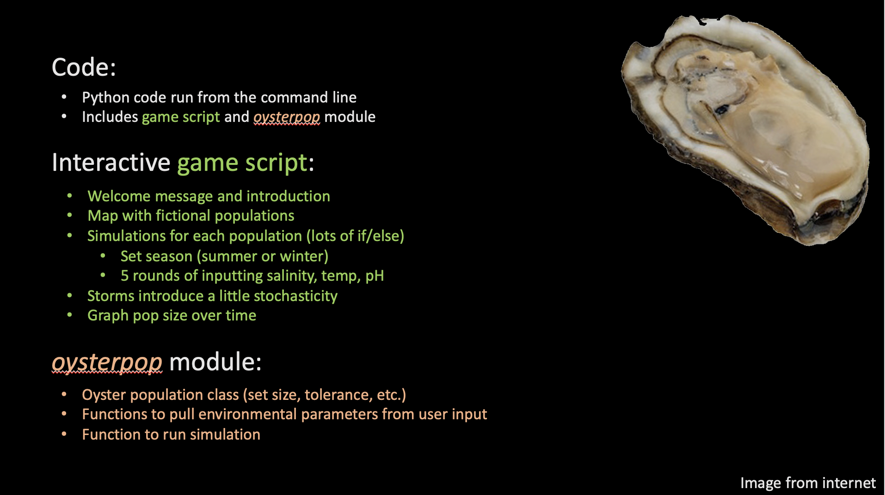

# oyster-game
This is a game created for educational science communication purposes. It is a simple model population simulation of two fictional oyster populations in coastal Rhode Island. Each have different evolutionary histories and hence different responses to environmental changes. This game prompts the user for salinity, temperature, and pH values to determine the population size of the 2 populations over time.

Download the video demo in the files above to see the full gameplay!

### To play for yourself:
(1) download *oysterpop.py*, game script *120420popsim.py*, and *landsat.png* into the same directory; and 
(2) run the game script from the command line!

### Visual overview of the game/module architecture: 

### Forthcoming updates to this project include:

* Celcius to Fahreheit conversion so the user can input temperature in F which is more familiar to most general audiences
* Tailoring background to a more specific audience to fill in some knowledge gaps
  - preliminary "screening" multiple choice questions to test user knowledge of coastal topics and oyster biology
  - if there is a knowlegde gap discovered through an incorrect answer of a screening question, the game will provide summary on that topic 
  - examples of screening questions pertaining to salinity: 
  *'What is the salinity of full sea water? a) 63ppt b)100ppt c)35ppt d)10ppt'*
  *'Do oysters prefer high or low salinity? a) high b) low.'*
* Adding in a more dramatic end screen to alert user when population has died and end the simulation once oysters have perished 
* Provide the reason for why a population increased or decreased in size over time as a supplement to the % updates in the game
* Long term goal: make a more sophisticated, realistic model that integrates a CO2 system calculator

**If you have any input on how to improve the simulation or the game, please feel free to contact me at mguidry@uri.edu!**
